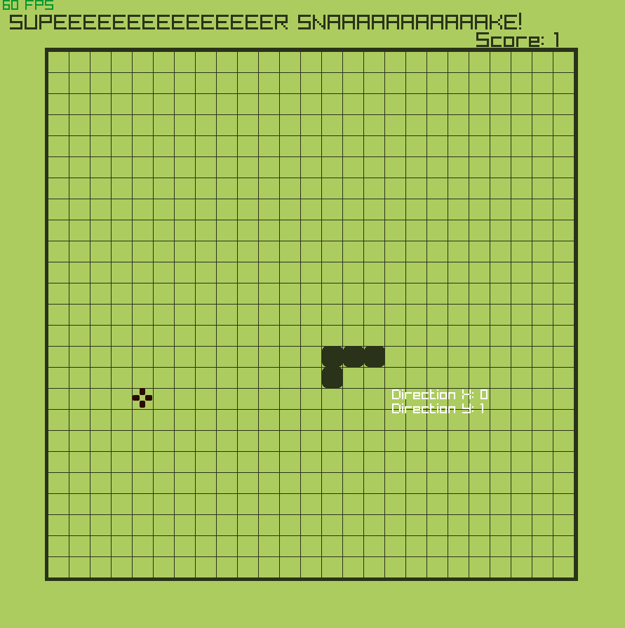

 # Super Snake (Raylib + C++17)

 
  
 

A simple Snake game built using Raylib and C++17.

    ↓ Based on this tutorial ↓
    https://youtu.be/LGqsnM_WEK4

 **<ins>Improvements & Fixes<ins>**

    Feature: Difficulty increases with each food eaten.

    Feature: "Game Over" screen.

    Feature: Retro-style grid for nostalgic feel.

    Change: Borderless window.

    Fix: Snake movement update rate.
